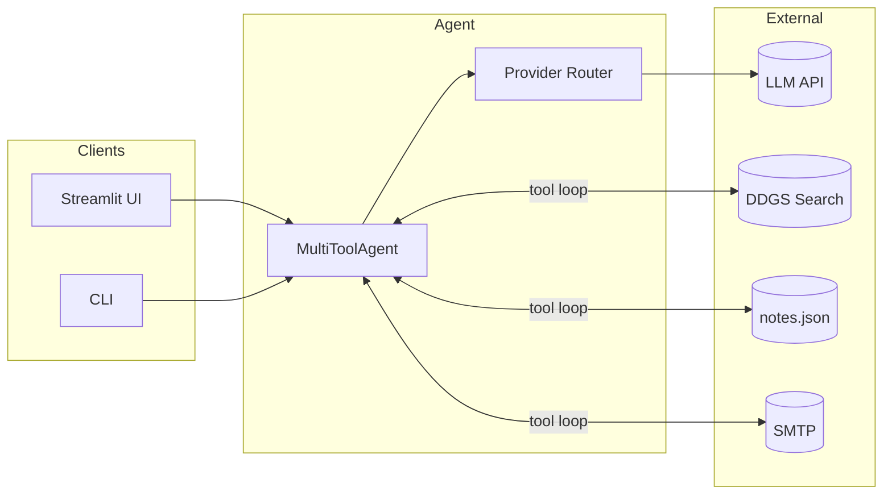

<div align="center">

# Multi-Tool AI Agent

### Enterprise-grade LLM assistant with function calling, multi-provider support, and real-world tools.

[](https://www.python.org/)
[](LICENSE)
[](https://streamlit.io/)
[](https://github.com/openai/openai-python)

**Web search · Persistent notes · Email automation · Groq · OpenAI · xAI · Gemini · Ollama**

[Features](#-features) ·
[Demo](#-demo) ·
[Installation](#-installation) ·
[Configuration](#-configuration) ·
[Documentation](#-documentation) ·
[Contributing](#-contributing)

</div>

---

## About

**Multi-Tool AI Agent** is an open-source Python framework for building **tool-augmented AI assistants**. It connects any OpenAI-compatible language model to a curated set of production-ready tools — so your agent can search the web, manage local notes, and send email instead of only generating text.

Designed for developers, students, and teams who want a **clean, extensible starting point** for agentic workflows without heavy frameworks or vendor lock-in.

| | |
|---|---|
| **Problem** | Chatbots hallucinate on current events and cannot act on your behalf |
| **Solution** | Function-calling loop + real tools + swappable LLM providers |
| **Outcome** | One codebase — Streamlit UI, CLI, and six built-in tools |

---

## Features

| | Feature | Description |
|:---:|---------|-------------|
| 🔌 | **Multi-provider LLM** | Groq, OpenAI, xAI Grok, Google Gemini, DeepSeek, local Ollama |
| 🛠️ | **Function calling** | OpenAI-style tool schemas with automatic Python dispatch |
| 🌐 | **Web search** | DDGS metasearch (DuckDuckGo, Bing, Brave) — no extra API key |
| 📝 | **Notes** | Save, list, retrieve, and delete notes (`data/notes.json`) |
| 📧 | **Email** | SMTP delivery (Gmail, Outlook, custom servers) |
| 🖥️ | **Dual interface** | Streamlit web app + Rich terminal CLI |
| 🔒 | **Provider isolation** | Per-provider keys and endpoints — no cross-provider leakage |
| ⚡ | **Zero framework lock-in** | Plain Python, OpenAI SDK, minimal dependencies |

---

## Demo

> **Web UI** — Run `streamlit run app.py` and open `http://localhost:8501`

```
┌─────────────────────────────────────────────────────────────────┐
│  🤖 Advanced Multi-Tool AI Agent                                │
│  Web search · Notes · Email · Function tools                    │
├─────────────────────────────────────────────────────────────────┤
│  You:  Search the web for AI agent trends in 2026 and save      │
│        a short summary as a note titled "ai-trends"             │
│                                                                 │
│  🔧 search_web  ▶  query, results                               │
│  🔧 save_note   ▶  title, content                             │
│                                                                 │
│  Agent: I've searched the web and saved your summary to         │
│         the note "ai-trends". Here's what I found…              │
└─────────────────────────────────────────────────────────────────┘
```

*Add a screenshot after your first run: save as `docs/images/ui-preview.png` and embed it here.*

---

## Installation

### Requirements

- **Python** 3.10 or newer  
- **pip** (package manager)  
- At least **one LLM API key** ([Groq](https://console.groq.com), [OpenAI](https://platform.openai.com), etc.)  
- *(Optional)* SMTP credentials for email  
- *(Optional)* [Ollama](https://ollama.com) for local inference  

### 1. Clone the repository

```bash
git clone https://github.com/YOUR_USERNAME/MultiToolAiAgent.git
cd MultiToolAiAgent
```

### 2. Create a virtual environment

<details>
<summary><b>Windows (PowerShell)</b></summary>

```powershell
python -m venv .venv
.venv\Scripts\activate
pip install -r requirements.txt
```

</details>

<details>
<summary><b>macOS / Linux</b></summary>

```bash
python3 -m venv .venv
source .venv/bin/activate
pip install -r requirements.txt
```

</details>

### 3. Configure environment

```bash
cp .env.example .env   # Linux / macOS
copy .env.example .env # Windows
```

Edit `.env` — minimal example for **Groq** (fast, free tier available):

```env
AI_PROVIDER=grok
GROK_API_KEY=gsk_your_api_key_here
```

### 4. Run the application

| Mode | Command | URL |
|------|---------|-----|
| **Web UI** | `streamlit run app.py` | http://localhost:8501 |
| **CLI** | `python main.py` | Terminal |
| **Windows shortcut** | `.\run.ps1 ui` | Auto venv + UI |

---

## Configuration

### Environment variables

| Variable | Required | Description |
|----------|:--------:|-------------|
| `AI_PROVIDER` | Recommended | Default provider: `grok`, `openai`, `xai`, `gemini`, `deepseek`, `ollama` |
| `GROK_API_KEY` | For Groq | API key from [console.groq.com](https://console.groq.com) (`gsk_…`) |
| `XAI_API_KEY` | For xAI | API key from [console.x.ai](https://console.x.ai) (`xai-…`) |
| `OPENAI_API_KEY` | For OpenAI | Standard OpenAI key (`sk-…`) |
| `GEMINI_API_KEY` | For Gemini | Google AI Studio key |
| `DEEPSEEK_API_KEY` | For DeepSeek | DeepSeek platform key |
| `SMTP_*` | For email | Host, port, user, password, `EMAIL_FROM` |

> **Never commit `.env` to Git.** It is listed in `.gitignore`.

### Provider reference

| ID | Service | Key format | API base URL | Example models |
|----|---------|------------|--------------|----------------|
| `grok` | [Groq](https://groq.com) | `gsk_` | `api.groq.com` | `llama-3.3-70b-versatile` |
| `xai` | [xAI Grok](https://x.ai) | `xai-` | `api.x.ai` | `grok-4.3`, `grok-3-mini` |
| `openai` | [OpenAI](https://openai.com) | `sk-` | `api.openai.com` | `gpt-4o-mini`, `gpt-4o` |
| `gemini` | [Google](https://ai.google.dev) | — | Google OpenAI-compatible | `gemini-2.0-flash` |
| `deepseek` | [DeepSeek](https://deepseek.com) | — | `api.deepseek.com` | `deepseek-chat` |
| `ollama` | [Ollama](https://ollama.com) | — | `localhost:11434` | `llama3.2`, `mistral` |

#### Groq vs xAI Grok

These names sound similar but are **different companies, APIs, and keys**:

| | Groq | xAI Grok |
|---|------|----------|
| **Use case** | Ultra-fast open-model inference | Official Grok models from xAI |
| **Key prefix** | `gsk_` | `xai-` |
| **Set in `.env`** | `GROK_API_KEY` | `XAI_API_KEY` |
| **`AI_PROVIDER`** | `grok` | `xai` |

---

## Documentation

### Built-in tools

| Tool | Parameters | Purpose |
|------|------------|---------|
| `search_web` | `query`, `max_results?` | Live web search (1–10 results) |
| `save_note` | `title`, `content` | Create or overwrite a local note |
| `list_notes` | — | List all notes with previews |
| `get_note` | `title` | Fetch full note body |
| `delete_note` | `title` | Remove a note |
| `send_email` | `to`, `subject`, `body` | Send plain-text email via SMTP |

Schemas are defined in `agent/tools/registry.py` using the OpenAI function-calling format.

### Example prompts

```text
Search the web for the latest Python 3.13 features and summarize them in 3 bullet points.

Save a note titled "weekly-goals" with: ship README, fix CI, demo to team.

List all my notes.

Send an email to team@company.com — subject: Release — body: v1.0 is live.
```

### CLI reference

```bash
python main.py                          # Interactive chat
python main.py "Your question here"     # Single-shot query
```

| Command | Action |
|---------|--------|
| `/reset` | Clear conversation history |
| `/quit`, `exit` | End session |

### Architecture



**Execution loop**

1. User message → LLM with tool definitions  
2. Model returns `tool_calls` → Python executes tools  
3. Tool output appended → LLM called again  
4. Repeat until final text response (max **10** rounds)

### Project structure

```text
MultiToolAiAgent/
├── app.py                      # Streamlit web application
├── main.py                     # CLI entry point
├── run.ps1                     # Windows launcher
├── requirements.txt
├── .env.example
├── LICENSE
│
├── agent/
│   ├── core.py                 # Agent orchestration
│   ├── providers.py            # Multi-provider configuration
│   └── tools/
│       ├── registry.py         # Tool schemas & dispatch
│       ├── web_search.py
│       ├── notes.py
│       └── email_tools.py
│
└── data/                       # Runtime (gitignored)
    └── notes.json
```

---

## Troubleshooting

<details>
<summary><b>ModuleNotFoundError: No module named 'ddgs' or 'streamlit'</b></summary>

Activate your virtual environment and install dependencies:

```bash
pip install -r requirements.txt
```

</details>

<details>
<summary><b>401 Unauthorized — invalid API key</b></summary>

- Confirm the **sidebar endpoint** matches your provider (Groq → `api.groq.com`).  
- Use `GROK_API_KEY` for `gsk_` keys, not `OPENAI_API_KEY`.  
- Restart Streamlit after editing `.env`.

</details>

<details>
<summary><b>Model not found</b></summary>

Model names are provider-specific. Use Llama/Mixtral on Groq; use `grok-*` only on xAI.

</details>

<details>
<summary><b>Verify configuration (diagnostic command)</b></summary>

```bash
python -c "from dotenv import load_dotenv; load_dotenv(); \
from agent.providers import get_provider, resolve_api_key, resolve_base_url; \
c = get_provider('grok'); \
print('URL:', resolve_base_url(c)); \
print('Key:', resolve_api_key(c)[:12] + '...')"
```

Expected for Groq: `https://api.groq.com/openai/v1` and a key starting with `gsk`.

</details>

---

## Security

- Store all secrets in `.env` — never in source code or Git history.  
- Rotate API keys immediately if exposed publicly.  
- The `send_email` tool sends **real emails**; verify recipients before confirming prompts.  
- Notes are stored locally in plain JSON — do not store classified data without encryption.  
- Web search queries are sent to third-party search backends (DDGS).  

---

## Tech stack

| Component | Technology |
|-----------|------------|
| Runtime | Python 3.10+ |
| LLM integration | OpenAI Python SDK (compatible endpoints) |
| Web interface | Streamlit |
| CLI | Rich |
| Search | DDGS (metasearch) |
| Config | python-dotenv |
| HTTP client | httpx |

---

## Roadmap

- [ ] Docker Compose deployment  
- [ ] Plugin system for custom tools  
- [ ] Conversation export (JSON / Markdown)  
- [ ] Rate limiting and usage metrics  
- [ ] Unit tests for tool registry  

---

## Contributing

Contributions are welcome. To propose a change:

1. **Fork** the repository  
2. **Create** a feature branch (`git checkout -b feature/amazing-feature`)  
3. **Commit** your changes (`git commit -m 'Add amazing feature'`)  
4. **Push** to the branch (`git push origin feature/amazing-feature`)  
5. **Open** a Pull Request  

Please keep PRs focused, follow existing code style, and do not include API keys or `.env` files.

---

## Acknowledgments

- [OpenAI](https://openai.com) — function-calling specification  
- [Groq](https://groq.com) · [xAI](https://x.ai) · [Google Gemini](https://ai.google.dev) — model APIs  
- [DDGS](https://github.com/deedy5/ddgs) — privacy-oriented metasearch  
- [Streamlit](https://streamlit.io) — rapid UI development  

---

## License

This project is licensed under the **MIT License** — see the [LICENSE](LICENSE) file for details.

---

<div align="center">

**If this project helped you, consider giving it a star on GitHub.**

Made with Python · Part of the [Nexe-Agent](https://github.com/YOUR_USERNAME) toolkit

</div>
